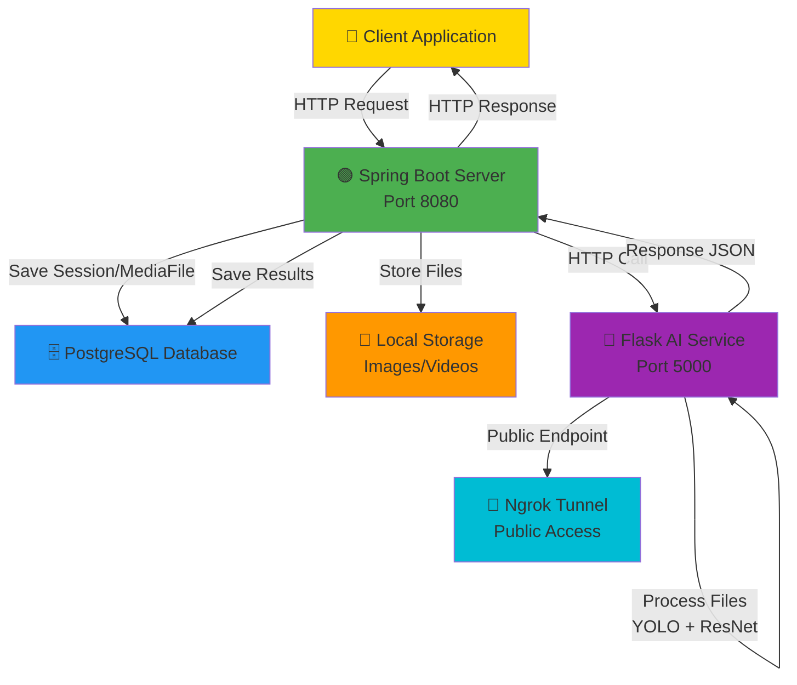
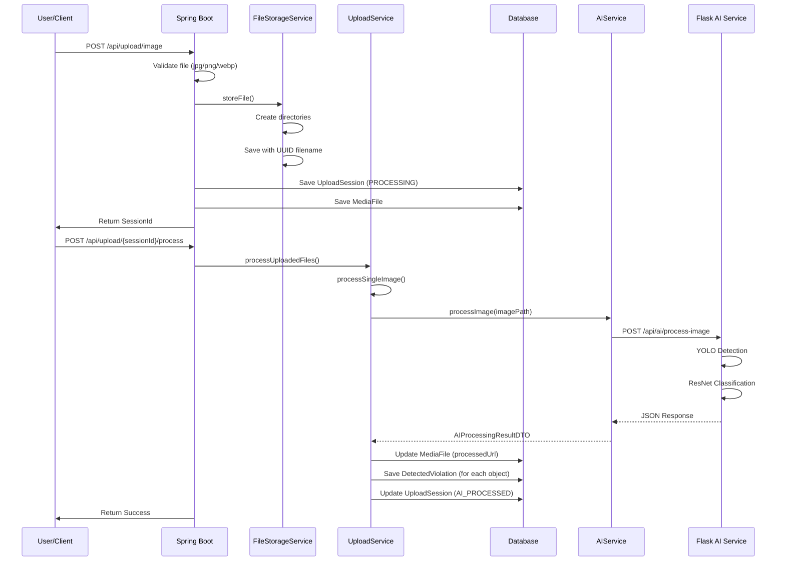
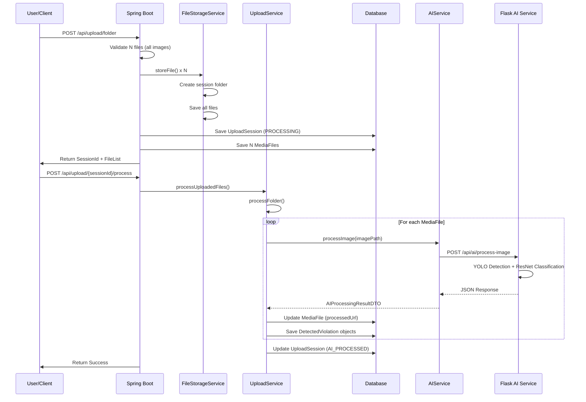
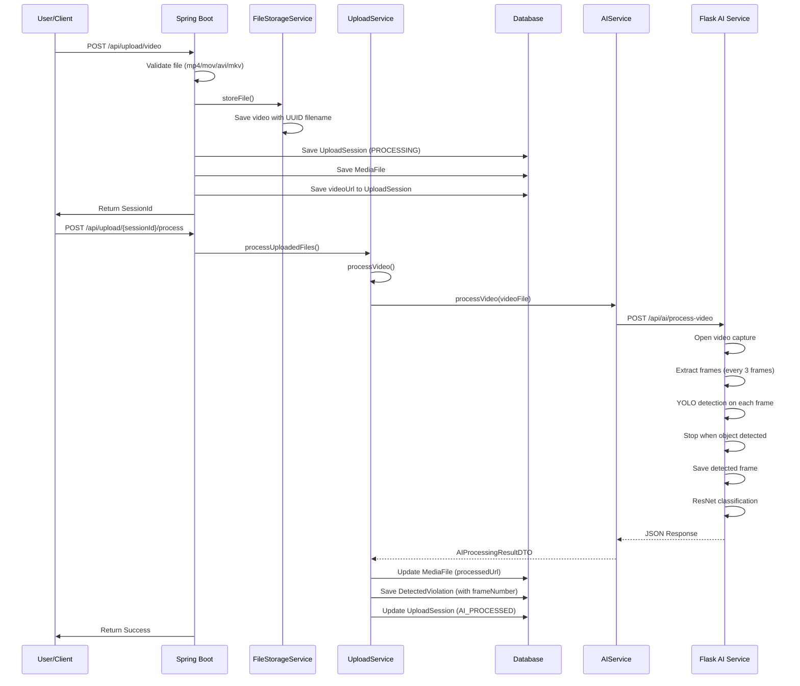
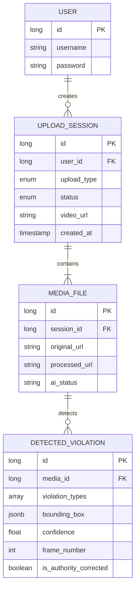
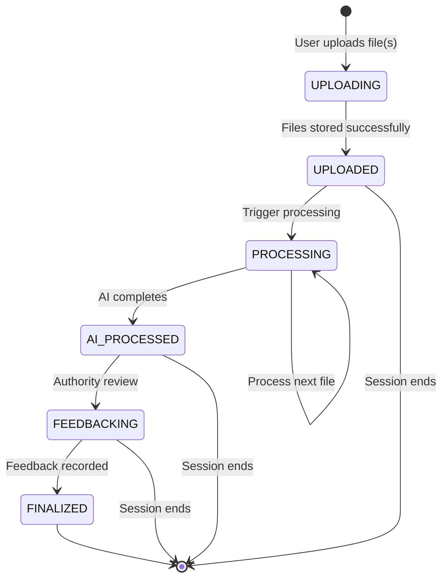
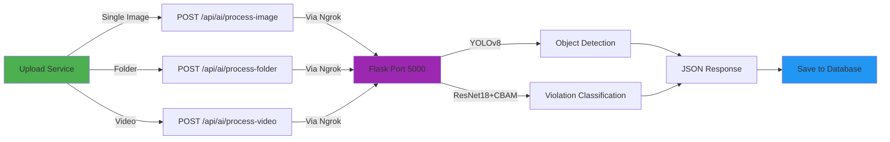
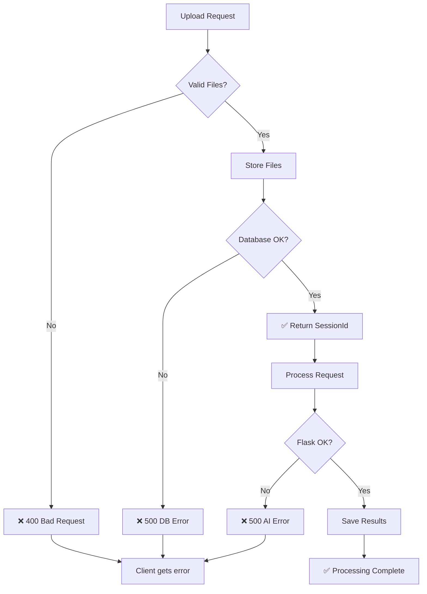
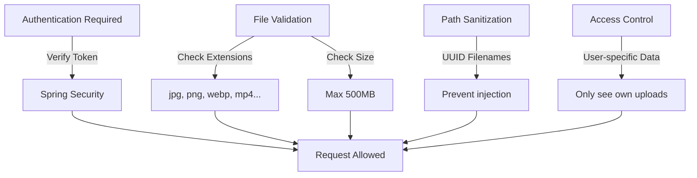

# Upload Feature Architecture & Flow Diagrams

## System Architecture



## Single Image Upload Flow



## Folder Upload Flow



## Video Upload Flow



## Data Model Relationships



## Processing States



## AI Service Endpoints Called



## Error Handling Flow



## File Organization in Storage

```
D:/MyDrive/DATN/storage/
├── image/
│   ├── uuid1.jpg (original image from session 1)
│   ├── uuid2.png (original image from session 2)
│   └── ...
├── folder/
│   ├── session-2/
│   │   ├── uuid3.jpg (image 1)
│   │   ├── uuid4.jpg (image 2)
│   │   └── uuid5.jpg (image 3)
│   ├── session-5/
│   │   ├── uuid6.jpg
│   │   └── ...
│   └── ...
└── video/
    ├── uuid7.mp4 (original video)
    ├── uuid8.avi (original video)
    └── ...

D:/MyDrive/DATN/storage/detected_image/ (Flask storage)
├── processed_uuid1.jpg (output from AI processing)
├── processed_uuid2.jpg
├── video_frame_uuid3.jpg (extracted frame from video)
└── ...
```

## API Response Time Estimates

| Operation | Duration | Notes |
|-----------|----------|-------|
| Single Image Upload | 100-500ms | File storage only |
| Single Image Processing | 2-5s | YOLO + ResNet inference |
| Folder (5 images) | 10-25s | Sequential processing |
| Video Processing | 5-15s | Frame extraction + detection |

## Database Query Patterns

```sql
-- Find all violations in a session
SELECT dv.* FROM detected_violations dv
JOIN media_files mf ON dv.media_id = mf.id
JOIN upload_sessions us ON mf.session_id = us.id
WHERE us.id = ?;

-- Get statistics by violation type
SELECT violation_types, COUNT(*) FROM detected_violations
GROUP BY violation_types;

-- Find violations by user
SELECT * FROM detected_violations dv
JOIN media_files mf ON dv.media_id = mf.id
JOIN upload_sessions us ON mf.session_id = us.id
JOIN users u ON us.user_id = u.id
WHERE u.id = ?;
```

## Security Considerations


